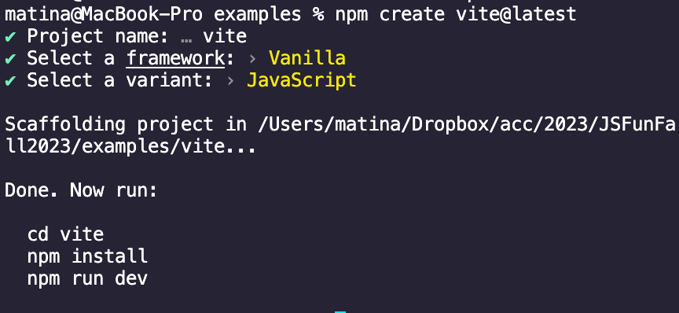
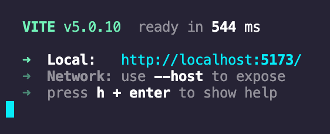
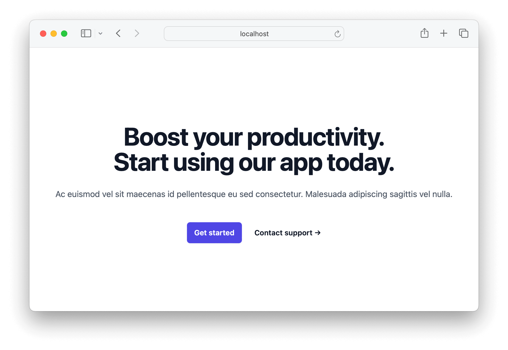
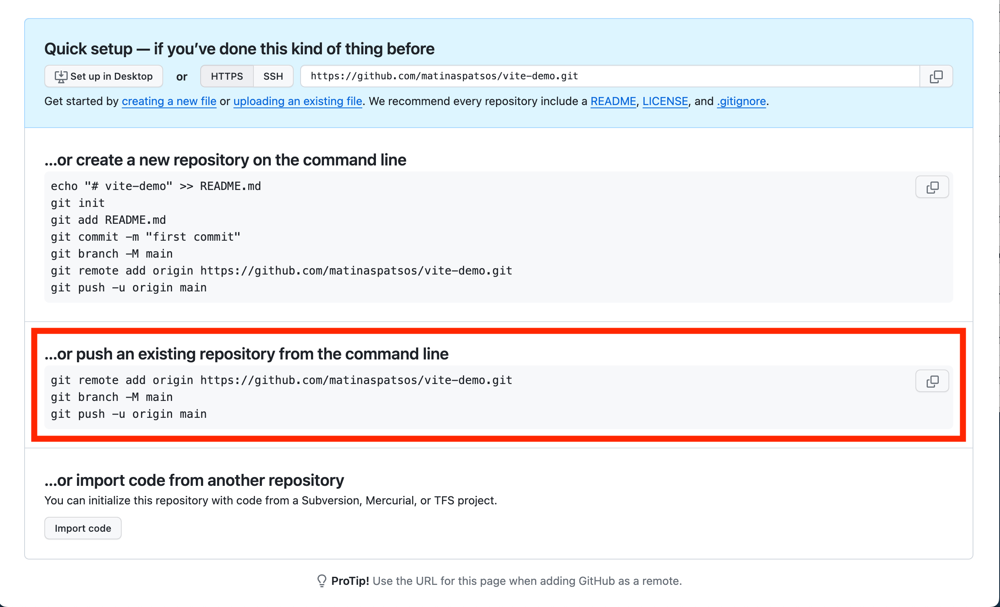

# Vite.js Tutorial

Press `command+shift+v` on Mac or `ctrl+shift+v` on Windows to preview this in Visual Studio Code.

[Vite.js](https://vitejs.dev/guide/why.html) (pronounced _veet_) is a popular toolset used by many JavaScript developers. The main reason developers chose Vite.js is because frameworks like React, Vue.js and Svelte require tooling like Vite or something similar. However, Vite can be used for any used for any frontend JavaScript project. Here are some of the reasons why you would want to use it:

- _Hot Module Replacement_ - Speed up your development time by automatically refreshing your webpage whenever you make a change.
- _Optimization_ - The larger your JavaScript and CSS files are, and the more files you have, the longer it takes for your site to load. Vite will minify your code to make your site load faster, like removing white space from your code to reduce your file size.
- _Package management_ - Install third party libraries with [NPM](https://www.npmjs.com/) or another package manager.
- _ES Modules_ - Use ES Modules in your web browser. No more CORS errors.
- _[TypeScript](https://www.typescriptlang.org/)_ - Reduce the amount of bugs in your code by introducing type annotations.
- _CSS Processing_ - Extend CSS with [PostCSS](https://postcss.org/) or preprocessors like [SASS](https://sass-lang.com/). You can add features like nesting, color functions, loops, mixins, and more.
- _Backwards compatibility and progressive enhancement_ - Support older browsers. Adopt newer JavaScript or CSS features without having to worry about browser support.
- _Framework support_ - Many JavaScript frameworks such as React, Vue, Next.js, Nuxt.js, Gatsby and Svelte require tooling like Vite.js. (Some come with their own tooling.)

However, there is much more that you can do with Vite. Vite is highly extensible. You can find many [community plugins](https://github.com/vitejs/awesome-vite?tab=readme-ov-file#plugins).

## Getting Started

To install, open your terminal or GitBash, and run the following:

```shell
# Say you want your Vite code to go in your Documents folder
cd ~/Documents
npm create vite@latest
```

This will prompt you to name the project. Call it "vite". Next, select "Vanilla" as the framework and choose "JavaScript" as the variant.



Now, follow the next set of instructions:

```shell
cd vite
npm install
```

Type `code .` to open the project in Visual Studio Code. Before continuing, take a look at the code that was created.

Now, the first thing you need to understand about Vite.js is that it has two different modes:

- _Development mode_ - Vite.js starts a server for development. This server has hot module replacement, which means it automatically refreshes the web page after any code changes.
- _Production mode_ - Vite.js has a bundler that prepares, packages, and optimizes your code for when you are ready to share your site with the world.

If you run `npm run dev`, this will start the development web server. A URL like http://localhost:5173/ should appear in the terminal. Click on the URL (`cmd + click` or `ctrl + click`) or type the URL directly in address bar of your web browser.



Trying to make a change to either the _index.html_, _main.js_, or _counter.js_. Notice how everything automatically refreshes.

Press `ctrl + c` to stop the development server.

Now, pretend that you are going to share your code with the world. Run `npm run build` in your terminal. After about a minute, this will create a new folder called _dist/_. Open the _dist/assets/index-....js_ file. This code looks different from the JavaScript that you were looking at a minute ago. It's optimized, meaning that it made changes to your code so that it downloads quicker. You can see that all white space is removed and all the JavaScript files were combined into one. If you open the _dist/assets/index-....css_, you can see similar optimizations to the CSS. When you are ready to share your code, you would upload the _dist/_ folder to a web hosting platform.

## Include files with ES Modules

Take another look at the source code. Start with the _index.html_ file. Take a look at how it loads the JavaScript code:

```html
<script type="module" src="/main.js"></script>
```

Note that this script tag has `type=module`. This is because Vite.js uses ES modules. Without `type=module`, your JavaScript will fail to load.

One thing that you won't file in your _index.html_ is any tags to load CSS styles. Instead, it is loaded in your JavaScript. Open up _main.js_ and take a look at the first line:

```js
// main.js
import "./style.css"; // includes CSS
import javascriptLogo from "./javascript.svg"; // includes a whole image
import viteLogo from "/vite.svg"; // includes image path, location on your computer (not the whole image). This image needs to be in the public folder in order for this to work.
import { setupCounter } from "./counter.js"; // includes JavaScript

// ...
```

With Vite.js, you can load your CSS inside of JavaScript. Note that in the next few lines, images are loaded inside of you JavaScript too. Files in the same directory need to begin with "./". All files that are import need to end with the extension (e.g. .js, .css, .png). Try experimenting with create new JavaScript, CSS, and other types of files and including them with ESM `import` and `export` statements.

To learn more about how files are included, see:

- https://vitejs.dev/guide/#index-html-and-project-root
- https://vitejs.dev/guide/features.html#static-assets
- https://vitejs.dev/guide/assets.html
- https://vitejs.dev/guide/features.html#import-inlining-and-rebasing

## Multiple pages

Create a new file called _home.html_ inside the root of you project (in the same folder as _index.html_). Add this:

```html
<!-- home.html-->
<!DOCTYPE html>
<html lang="en" class="h-full">
  <head>
    <meta charset="UTF-8" />
    <meta name="viewport" content="width=device-width, initial-scale=1.0" />
    <title>BusinessAI</title>
  </head>
  <body class="h-full">
    <main
      class="grid min-h-full place-items-center bg-white px-6 py-24 sm:py-32 lg:px-8"
    >
      <div class="text-center">
        <h1>
          Boost your productivity.<br />
          Start using our app today.
        </h1>
        <p class="mt-6 text-base leading-7 text-gray-600">
          Ac euismod vel sit maecenas id pellentesque eu sed consectetur.
          Malesuada adipiscing sagittis vel nulla.
        </p>
        <div class="mt-10 flex items-center justify-center gap-x-6">
          <a href="#">Get started</a>
          <a href="#" class="text-sm font-semibold text-gray-900"
            >Contact support <span aria-hidden="true">&rarr;</span></a
          >
        </div>
      </div>
    </main>
  </body>
</html>
```

If there, delete the _dist/_ folder. Now run `npm run build`. If you open the new _dist_ folder, the _home.html_ is not there.

One limitation to vite is does not support multiple pages by default. You will need to update the Vite configuration if you planning on adding anymore HTML files to your project. (See https://vitejs.dev/guide/build.html#multi-page-app)

Create a new file called _vite.config.js_ inside of root of your project. Your folder structure should look like this:

```
> public
  ...
home.html
index.html
package.json
vite.config.js
```

Add the following code to _vite.config.js_:

```js
// vite.config.js
import path from "path";
import { sync } from "glob";
import { defineConfig } from "vite";

export default defineConfig({
  build: {
    rollupOptions: {
      /**
       * Add this look for and include all HTML files
       * when we use `npm run build`
       */
      input: sync(path.resolve(__dirname, "**/*.html")),
    },
  },
});
```

The code above uses a third party package called [_glob_](https://www.npmjs.com/package//glob) to search for all HTML files. You will need to install this library.

```shell
npm install -D glob
```

Delete the _dist/_ folder and now try buliding again. Run `npm run build`. You should see the _home.html_ file in the _dist/_ folder now. You can run `npm run preview` to test the build. You will need to open a URL like http://localhost:4173/home.html in your browser. The port (e.g. 4173) may vary. Use the port number that you see in your terminal. Once you are done, press `ctrl + c` to quit preview mode.

## CSS processing and frameworks (Tailwind CSS)

Next, you are going add third party library and learn a little about CSS processing. You are going to add the CSS framework [Tailwind](https://tailwindcss.com/) to your project.

Start by installing Tailwind and its dependencies:

```shell
npm install -D tailwindcss postcss autoprefixer
```

Next, generate the configuration files:

```shell
npx tailwindcss init -p
```

This creates two files: _tailwind.config.js_ and _postcss.code.js_.

You will need to configure tailwind so that it knows which files are using Tailwind. Open _tailwind.config.js_, and add this:

```js
// tailwind.config.js
/** @type {import('tailwindcss').Config} */
export default {
  /**
   * You need to tell Tailwind what files are using Tailwind.
   * This will parse all your HTML files, and all JavaScript inside `src/`
   */
  content: ["./**/*.html", "./src/*.{js,ts}"],
  theme: {
    extend: {},
  },
  plugins: [],
};
```

Next, we need to include Tailwinds styles and classes. To do this, we are going to include Tailwinds in a CSS file, which then the CSS file will be included in a JavaScript, which will then be include in your HTML files.

Create a folder called _src/_ in the root and create a new file called _src/index.css_. This file is normally would be a global, base CSS file. In other words, a CSS file that is used everywhere. Add this CSS:

```css
/* src/index.css */
@tailwind base;
@tailwind components;
@tailwind utilities;

/* ... Other global CSS code .. */
```

This will include Tailwind styles and classes.

You will need to include Tailwind's CSS in order for this to work. Create a file called _src/index.js_. Again, this would normally be a global JavaScript file. It should contain:

```js
// src/index.js
import "./index.css";

// Other global code ...
```

Your file structure should look like this:

```
> src/
    index.css
    index.js
home.html
package.json
postcss.config.js
tailwind.config.js
vite.config.js
```

Update the header of _home.html_ so that is loads Tailwind:

```html
<!-- home.html-->
<head>
  <!-- ... -->
  <!-- Add this. It will load Tailwind -->
  <script type="module" src="/src/index.css"></script>
  <!-- ... -->
</head>
```

Start the development server with `npm run dev` and open http://localhost:5173/home.html in your web browser. (The 5173 may be a different number). If Tailwind worked, you should see text centered on the page.

Now, add more Tailwind styles to your HTML. Find the `<h1>` tag and add CSS classes:

```html
<!-- home.html-->
<h1 class="mt-4 text-3xl font-bold tracking-tight text-gray-900 sm:text-5xl">
  Boost your productivity.<br />
  Start using our app today.
</h1>
```

Add CSS classes to the "Get Started" button too (`<a>` tags).

```html
<!-- home.html-->
<a
  href="#"
  class="rounded-md bg-indigo-600 px-3.5 py-2.5 text-sm font-semibold text-white shadow-sm hover:bg-indigo-500 focus-visible:outline focus-visible:outline-2 focus-visible:outline-offset-2 focus-visible:outline-indigo-600"
  >Get started</a
>
```

Your header should be much larger and bolder. The "Get Started" button should have a purplish background.



Before we move on, you should test and make sure that Tailwind is included in your production code. If you the development server running, press `ctrl + c` to quit.

```shell
rm -rf dist || echo "No directory to delete"
npm run build
npm run preview
```

Open the URL http://localhost:4173/home.html in your browser. The port (e.g. 4173) could be different. If fails to load, use the port number that you see in your terminal. You can press `ctrl + c` in your terminal to quit preview mode.

See [Tailwind's documentation](https://tailwindcss.com/docs/utility-first) and [UI component showcase](https://tailwindui.com/components) to learn what other classes and features are available with Tailwind. (You will have to pay to view the code for many of the component showcase.)

For the official documentation on installing Tailwind with Vite, see https://tailwindcss.com/docs/guides/vite

## Supporting older browsers

In the real world, our customer's don't always have the latest software. Depending on your product, you may need to support older browsers. Vite makes this easy. You just need to add Vite's legacy plugin to our project and it will take care of supporting older browsers for you.

You are going to compare the current production build without older browser support to a production build with the legacy plugin. If you do not see a _dist/_ folder, run `npm run build` to create one. You will to move it outside of this project.

```shell
mv ./dist ../dist-no-legacy
```

Next, install [@vitejs/plugin-legacy](https://github.com/vitejs/vite/tree/main/packages/plugin-legacy):

```shell
npm add -D @vitejs/plugin-legacy
```

Update the _vite.config.js_. For the purpose of this tutorial, we are going to support Internet Explorer 11.

```js
// vite.config.js
import path from "path";
import { sync } from "glob";
import { defineConfig } from "vite";
// Add this line:
import legacy from "@vitejs/plugin-legacy";

export default defineConfig({
  build: {
    // ...
  }
  // Add this:
  plugins: [
    legacy({
      /**
       * This line tells Vite what browsers we need to support. For examples,
       * @see https://github.com/browserslist/browserslist?tab=readme-ov-file#full-list
       */
      targets: ["defaults", "ie 11"],
    }),
  ],
});
```

Now, test to see if this worked. Run `npm run build`. Compare the files in the new _dist/_ folder with the _dist-no-legacy/_ folder that is outside of this project. (You can use `code ../dist-no-legacy/` to open in a new VSCode window.) The newer build includes a lot more code. It's contains polyfills and is rewritten in a way that Internet Explorer will understand. If you have Internet Explorer on you machine, run `npm run preview`, and open the URL you see in your terminal inside Internet Explorer. You can press `ctrl + c` in your terminal to quit preview mode.

## TypeScript

You can think of [TypeScript](https://www.typescriptlang.org/) as "JavaScript plus". It adds a strict type system and some added object oriented programming features to JavaScript. If you would like to work with TypeScript, you can install TypeScript with Vite.

Create a new Vite project:

```shell
# Say you want your Vite code to go in your Documents folder
cd ~/Documents
npm create vite@latest
```

This will prompt you to name the project. Call it "vite-typescript". Next, select "Vanilla" as the framework and choose "TypeScript" as the variant. Follow the instructions to install and start.

## Frameworks, integrations, and more

This tutorial covered only a couple of features that are supported by Vite. You can read [Vite's documentation](https://vitejs.dev/guide/features.html) to learn more. Developers can add there own features to Vite with plugins, meaning that there is a large ecosystem of features that you can add to Vite. Many of them are documented here: https://github.com/vitejs/awesome-vite?tab=readme-ov-file#plugins

Vite integrates with some of the most popular JavaScript frameworks, including React, Vue, Svelte, Electron, and more:

- [Official Vite integrations](https://github.com/vitejs/vite/tree/main/packages/create-vite)
- [Community integrations](https://github.com/vitejs/awesome-vite?tab=readme-ov-file#get-started)

Vite.js integrates with backend languages and frameworks such as Node.js, ASP.NET, Laravel, Django, Flask, and Ruby on Rails. It evens integrates with Wordpress, Shopify, and other CMS platforms.

- [Backend integrations](https://github.com/vitejs/awesome-vite?tab=readme-ov-file#integrations-with-backends)
- [Creating your own backend integration](https://vitejs.dev/guide/backend-integration.html)

## Deploying

Vite has [guides deploying to many different hosting solutions](https://vitejs.dev/guide/static-deploy.html). However, in this tutorial, you are going to learn how to upload your website to [Github Pages](https://pages.github.com/).

First, install git locally and commit all of your changes.

```shell
git init
git add .
git commit -m "Initial commit"
```

Next, will first need to [create a repository on Github](https://docs.github.com/en/repositories/creating-and-managing-repositories/creating-a-new-repository#creating-a-new-repository-from-the-web-ui). Name your repository "vite-demo". You can stick with the defaults. When you see this screen:



Copy the commands underneath "…or push an existing repository from the command line". Paste them inside of your terminal and hit enter. Then refresh the page. You should now see your code.

Now you are going to setup Github pages. Click on the "Settings" tab in the same toolbar that has "Code", "Issues", and "Pull Request". It should be on the right.

In the sidebar, click on "Pages".

Underneath where it says "Source", click on the dropdown and select "Github Actions".


Set this aside. We will return to this page later on.

Update your _vite.config.js_ file to include the name of the Github repository that you created.

```js
// vite.config.js
// ...

export default defineConfig({
  /**
   * This should be the name of your Github repository in between backslashes
   */
  base: "/vite-demo/",
  // ...
});
```

Test and see if your configuration is working.

```shell
rm -rf dist || echo "No directory to delete"
npm run build
npm run preview
```

Click on the link in your terminal. Your website should load without any issues. Check to see that the URL is http://localhost:4173/vite-demo/ (or whatever you named your Github repo). If everything worked, press `ctrl + c` in your terminal to exit preview mode.

Next step is to create a new deployment script:

```shell
mkdir .github
mkdir .github/workflows
touch .github/workflows/deploy.yml
code .github/workflows/deploy.yml
```

Copy and paste the code below inside of _.github/workflows/deploy.yml_:

```yml
# .github/workflows/deploy.yml
# Simple workflow for deploying static content to GitHub Pages
name: Deploy static content to Pages

on:
  # Runs on pushes targeting the default branch
  push:
    branches: ["main"]

  # Allows you to run this workflow manually from the Actions tab
  workflow_dispatch:

# Sets the GITHUB_TOKEN permissions to allow deployment to GitHub Pages
permissions:
  contents: read
  pages: write
  id-token: write

# Allow one concurrent deployment
concurrency:
  group: "pages"
  cancel-in-progress: true

jobs:
  # Single deploy job since we're just deploying
  deploy:
    environment:
      name: github-pages
      url: ${{ steps.deployment.outputs.page_url }}
    runs-on: ubuntu-latest
    steps:
      - name: Checkout
        uses: actions/checkout@v4
      - name: Set up Node
        uses: actions/setup-node@v4
        with:
          node-version: 20
          cache: "npm"
      - name: Install dependencies
        run: npm ci
      - name: Build
        run: npm run build
      - name: Setup Pages
        uses: actions/configure-pages@v4
      - name: Upload artifact
        uses: actions/upload-pages-artifact@v3
        with:
          # Upload dist folder
          path: "./dist"
      - name: Deploy to GitHub Pages
        id: deployment
        uses: actions/deploy-pages@v4
```

Your file structure should look like this:

```
> .github/
  > workflows/
      deploy.yml
index.html
package-lock.json
package.json
vite.config.js
...
```

Commit and push your changes.

```shell
git add .
git commit -m "Deployment script"
git push origin main
```

Return this screen in Github:


The next part may take a few minutes. Every 20 seconds or so, try refreshing your screen. When you see a "Your site is now live at ..." link, then the deployment is complete.


If you see the link, then click on the link to open your site. Your site should load.

If you do not see the link after a few minutes, click on the "Action" tab in the same toolbar that has "Code" and "Branches". If you don't see the "Deployment script" workflow, something is wrong with your settings or the deploy.yml file you created. Try going through the steps again and double checking everything. If you do see a "Deployment script" workflow, click on it, and then click on "deploy" to learn what went wrong. You can click on the "Re-run jobs" button to try to redeploy.

In the future, if you want to deploy any changes to your website:

1. Commit all of your changes
2. Run `git push origin main`

Then it should take a little a minute for the changes to go into effect.
